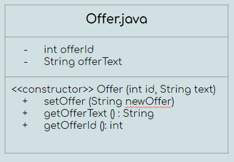

## Progress report
###### Group members: Kyrie, Favour, & Urszula

Since we have started our project, we have created and completed all of the input files that we will be using within our code. Specifically, we created a file for movies, which has all the details of the movies currently in theaters, a file for offer, which contains the coupon that will be printed at the bottom of the 'receipt', and lastly, a file for the prices, which contains the cost of the tickets for each individual person (e.g., adult, child, senior, and student). Additionally, we have completely finished two of the three classes we will be using: offer and prices. We are still modifying the code in our main class - making sure that it is reading the input file correctly. Further, we are still writing lines of code that prints out the information from our input file - this is a challenge that we have been trying to resolve from the previous week. It seems that we may have to perhaps, restructure the file itself, or consider in what order we want to present the information and revisit previous work that we completed during our practicals, and labs. Within the next week, we plan to finish the main file, and begin working on our powerpoint presentation, along with our final reflection for the project. We have divided responsibilities in that Kyrie will work on making adjustments to the prices, and Favour and I will be working on getting the movies file to print what we need correctly. Altogether, we plan to communicate and troubleshoot any compile errors, or check style warnings we may receive when working on our individual parts.

## *UML Diagram*
These are the UML diagrams that we have created to help us organize our classes, and the files we will have to use to make our project a success.  

