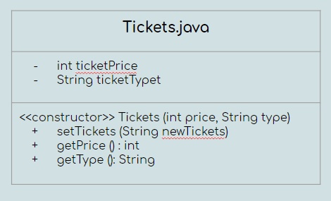

# Project Report: The Groovy Movies
### Group members: Kyrie Doniz, Urszula Oszczapinska, Favour Ojo

## Introduction
Our program aims to provide a user-friendly interface for choosing a movie and purchasing tickets to watch it at a movie theater. Our program goes through giving the user the option to view what movies are playing, the times that they are playing, and gives the user the option to choose their preferred showtime. Additionally, the program walks through the process of choosing a ticket type and purchasing it. At the end of the program, the user is provided facts about the movie they selected such as the genre of the movie, the rating of the movie and a one sentence synopsis. Also, the user is given a coupon that they will be able to use during their next movie purchase. In order to have a successful program, we used three different classes (Main, Tickets and Offer) along with four different input files that contained the appropriate information. Each one of us collaborated simultaneously using tele-type, ensuring that everyone contributed to the project equally and shared their ideas on how to implement, and satisfy all the criteria for this assignment. On sections that we had challenges with, we made sure to utilize resources such as the technical leaders and previous completed assignments.

## Motivation
Our main motivation was to create a program that will utilize code that we have been practicing to implement all semester long, as well as its application to the real-world where individuals want an efficient way to know about what movies are currently in theatre without having to go on the site, and browse through options. While thinking about ideas for the project, we thought about ways that we would like to use technology and we all came to the conclusion that we wanted to model applications like Fandango, and the kiosks that are found in theaters today. As businesses integrate technology into user interaction, it is important to provide all types of options which our program intends to do; it provides a phone or computer-based application for browsing current movies. Through the creation of such applications, one can begin to tailor applications to certain audiences (e.g., more user-friendly for older adults or those that do not speak the native language). Additionally, these platforms can be a strategic way to obtain data about the movie type, and movie showing times that individuals selected, allowing for various ways to market certain movies or provide promotions to reoccurring consumers. Furthermore, this could lead to personalized profiles for people to refer to, a feature Netflix is currently using.

In regards to non-project motivations, we wanted to have the opportunity to finally work together as a group of three. On previous assignments, we have communicated to each other about our challenges, and offered one another insight on different troubleshooting ideas. Furthermore, we have worked outside of class to help each other understand the concepts taught in class -- we always have a good time!

## Project Implementation Details
We implemented several of the concepts we learned throughout the semester into our program. These include:
- `If statements`: For asking the user if they want to watch a movie, 'yes' or 'no' choice that either continues with the program, or ends and exits. Additionally, we used if/else statements to print out movie facts at the end of the individual's purchase.
- `Arrays`: For listing out the films playing at the movie theater and for listing out the ticket prices
- `Three classes`: Main.java (main program), Offer.java (for the offer at the end of the program), and Tickets.java (used to display the ticket prices)
- `While loops`: To print out all of the movie titles available
- `Scanner`: To read user input and from input files that we made containing information about the movies and ticket prices
- `Math`: Used to calculate each of the individual ticket prices
- `Six methods`: Each method was used for a different aspect of the code in the two classes utilized for the code to function. For instance, in the Tickets class, the setTickets method was utilized to set the price of the tickets. Also in the Tickets class, the method getPrice was utilized to obtain each ticket price. Finally in the Tickets class, the method getType was utilized to obtain ticket type. Now, in the Offer class, we also used three methods to ensure the code will work. The setOffer method was utilized to officially set the offer. The getOfferText method was utilized to get the offer text needed. Finally, the getOfferId method was utilized to the get the offer ID.

## UML Diagrams



## Project Results and Output
##### Output 1:
```
Welcome to Groovy Movies! Today's date is: Mon Dec 09 21:21:20 EST 2019

Would you like to know what movies are playing now?
yes
Okay!

The following films are currently showing: [Ford v. Ferrari, Charlie's Angels, Last Christmas, Doctor Sleep, Playing with Fire, Joker, Maleficent: Mistress of Evil, Terminator: Dark Fate]

What film would you like to see? (Case sensitive)

Maleficent: Mistress of Evil

Okay, you would like to see Maleficent: Mistress of Evil.

The showing times for Maleficent: Mistress of Evil are: 10:30am, 11:45am, 1:30pm, 3:20pm, 6:00pm, 8:00pm, 10:10pm

What showing of Maleficent: Mistress of Evil would you like to see?
1:30pm
Okay, you would like to go to the 1:30pm showing.

Choose from the following ticket types:
Ticket 1: Adult (ages 18+) $13
Ticket 2: Child (ages 4+) $9
Ticket 3: Student (with proof of ID) $10
Ticket 4: Senior (ages 65+) $7

Now we will ask you how many tickets you'd like.

Please enter the number of adult tickets needed:
0
Please enter the number of child tickets needed:
0
Please enter the number of student tickets needed:
3
Please enter the number of senior tickets needed:
0

Okay, you will be purchasing a ticket for: 0 adult(s) 0 child(ren) 3 student(s) and 0 senior(s).

The total cost of your ticket purchase is: $30.0
Coupon 123: "After a purchase of $25+, you get free popcorn and a drink."

You will be watching Maleficent: Mistress of Evil at 1:30pm

Thank you for choosing Groovy Movies! Enjoy your film!

Here are some quick facts about Maleficent: Mistress of Evil
Maleficent: Mistress of Evil is rated PG.
Maleficent: Mistress of Evil is considered to be a Fantasy movie.
Synopsis: A formidable queen (Michelle Pfeiffer) causes a rift between Maleficent (Angelina Jolie) and Princess Aurora (Elle Fanning).
```
For the first output, the user answered yes when asked if they would like to see any of the current movies playing. Then they are shown the current movies playing in an ArrayList. After that, the user will need to input which movie they would like to see. In this output, the user chose Maleficent: Mistress of Evil. After that, the user will need to input which showing time out of the ones listed is convenient for them. In this case, the user chose the 1:30pm showing time. Lastly, the user needs to input and specify how many and what kind of ticket types they prefer. In this output, the user selected 0 adult tickets, 0 child tickets, 3 student tickets, and 0 senior tickets. The program will then print their selection and the final total cost of the ticket purchase which for this output is $30.0. A coupon will also be printed out. Finally, a summary of the purchase will be shown and quick facts about the movie as well such as the synopsis, the genre and the rating.
##### Output 2:
```
Welcome to Groovy Movies! Today's date is: Mon Dec 09 21:23:46 EST 2019

Would you like to know what movies are playing now?
no
You must say yes to use our application.
Goodbye now!
```
For the second output, the program will welcome the user then prompt the user to see if they want to know what movies are playing. The user input in this case was no, so the program was cut short and gave a final statement to end the program.
##### Output 3:
```
Welcome to Groovy Movies! Today's date is: Mon Dec 09 21:23:46 EST 2019

Would you like to know what movies are playing now?
no
You must say yes to use our application.
Goodbye now!
C:\Users\kyrie\Documents\cs100\labs\project-two-freshmen-and-a-senior>gradle -q --console plain run
Welcome to Groovy Movies! Today's date is: Mon Dec 09 21:24:11 EST 2019

Would you like to know what movies are playing now?
yes
Okay!

The following films are currently showing: [Ford v. Ferrari, Charlie's Angels, Last Christmas, Doctor Sleep, Playing with Fire, Joker, Maleficent: Mistress of Evil, Terminator: Dark Fate]

What film would you like to see? (Case sensitive)

Charlie's Angels

Okay, you would like to see Charlie's Angels.

The showing times for Charlie's Angels are: 10:30am, 11:45am, 1:30pm, 3:20pm, 6:00pm, 8:00pm, 10:10pm

What showing of Charlie's Angels would you like to see?
8:00pm
Okay, you would like to go to the 8:00pm showing.

Choose from the following ticket types:
Ticket 1: Adult (ages 18+) $13
Ticket 2: Child (ages 4+) $9
Ticket 3: Student (with proof of ID) $10
Ticket 4: Senior (ages 65+) $7

Now we will ask you how many tickets you'd like.

Please enter the number of adult tickets needed:
3
Please enter the number of child tickets needed:
2
Please enter the number of student tickets needed:
0
Please enter the number of senior tickets needed:
1

Okay, you will be purchasing a ticket for: 3 adult(s) 2 child(ren) 0 student(s) and 1 senior(s).

The total cost of your ticket purchase is: $64.0
Coupon 123: "After a purchase of $25+, you get free popcorn and a drink."

You will be watching Charlie's Angels at 8:00pm

Thank you for choosing Groovy Movies! Enjoy your film!

Here are some quick facts about Charlie's Angels
Charlie's Angels is rated PG-13.
Charlie's Angels is considered to be an Action movie.
Synopsis: A sexy, high-octane update of the original '70s action-comedy TV series.
```
For the third output, the program welcomes the user then the user answered yes when asked if they would like to see any of the current movies playing. Then they are shown the current movies playing in an ArrayList. After that, the user will need to input which movie they would like to see. In this output, the user chose Charlie's Angels. After that, the user will need to input which showing time out of the ones listed is convenient for them. In this case, the user chose the 8:00pm showing time. Lastly, the user needs to input and specify how many and what kind of ticket types they prefer. In this output, the user selected 3 adult tickets, 2 child tickets, 0 student tickets, and 1 senior tickets. The program will then print their selection and the final total cost of the ticket purchase which for this output is $64.0. A coupon will also be printed out. Finally, a summary of the purchase will be shown and quick facts about the movie as well such as the synopsis, the genre and the rating.
##### Output 4:
```
Welcome to Groovy Movies! Today's date is: Mon Dec 09 21:25:38 EST 2019

Would you like to know what movies are playing now?
yes
Okay!

The following films are currently showing: [Ford v. Ferrari, Charlie's Angels, Last Christmas, Doctor Sleep, Playing with Fire, Joker, Maleficent: Mistress of Evil, Terminator: Dark Fate]

What film would you like to see? (Case sensitive)

Joker

Okay, you would like to see Joker.

The showing times for Joker are: 10:30am, 11:45am, 1:30pm, 3:20pm, 6:00pm, 8:00pm, 10:10pm

What showing of Joker would you like to see?
10:30am
Okay, you would like to go to the 10:30am showing.

Choose from the following ticket types:
Ticket 1: Adult (ages 18+) $13
Ticket 2: Child (ages 4+) $9
Ticket 3: Student (with proof of ID) $10
Ticket 4: Senior (ages 65+) $7

Now we will ask you how many tickets you'd like.

Please enter the number of adult tickets needed:
0
Please enter the number of child tickets needed:
2
Please enter the number of student tickets needed:
7
Please enter the number of senior tickets needed:
0

Okay, you will be purchasing a ticket for: 0 adult(s) 2 child(ren) 7 student(s) and 0 senior(s).

The total cost of your ticket purchase is: $88.0
Coupon 123: "After a purchase of $25+, you get free popcorn and a drink."

You will be watching Joker at 10:30am

Thank you for choosing Groovy Movies! Enjoy your film!

Here are some quick facts about Joker
Joker is rated R.
Joker is considered to be a Drama.
Synopsis: Failed comedian Arthur Fleck encounters violent thugs while wandering the streets of Gotham City dressed as a clown. Disregarded by society, Fleck begins a slow descent into madness as he transforms into the criminal mastermind known as the Joker.
```
For the fourth output, the user answered yes when asked if they would like to see any of the current movies playing. Then they are shown the current movies playing in an ArrayList. After that, the user will need to input which movie they would like to see. In this output, the user chose Joker. After that, the user will need to input which showing time out of the ones listed is convenient for them. In this case, the user chose the 10:30am showing time. Lastly, the user needs to input and specify how many and what kind of ticket types they prefer. In this output, the user selected 0 adult tickets, 2 child tickets, 7 student tickets, and 0 senior tickets. The program will then print their selection and the final total cost of the ticket purchase which for this output is $88.0. A coupon will also be printed out. Finally, a summary of the purchase will be shown and quick facts about the movie as well such as the synopsis, the genre and the rating.
##### Output 5:
```
Welcome to Groovy Movies! Today's date is: Mon Dec 09 21:26:44 EST 2019

Would you like to know what movies are playing now?
yes
Okay!


The following films are currently showing: [Ford v. Ferrari, Charlie's Angels, Last Christmas, Doctor Sleep, Playing with Fire, Joker, Maleficent: Mistress of Evil, Terminator: Dark Fate]

What film would you like to see? (Case sensitive)

Ford v. Ferrari

Okay, you would like to see Ford v. Ferrari.

The showing times for Ford v. Ferrari are: 10:30am, 11:45am, 1:30pm, 3:20pm, 6:00pm, 8:00pm, 10:10pm

What showing of Ford v. Ferrari would you like to see?
11:45am
Okay, you would like to go to the 11:45am showing.

Choose from the following ticket types:
Ticket 1: Adult (ages 18+) $13
Ticket 2: Child (ages 4+) $9
Ticket 3: Student (with proof of ID) $10
Ticket 4: Senior (ages 65+) $7

Now we will ask you how many tickets you'd like.

Please enter the number of adult tickets needed:
6
Please enter the number of child tickets needed:
0
Please enter the number of student tickets needed:
2
Please enter the number of senior tickets needed:
8

Okay, you will be purchasing a ticket for: 6 adult(s) 0 child(ren) 2 student(s) and 8 senior(s).

The total cost of your ticket purchase is: $154.0
Coupon 123: "After a purchase of $25+, you get free popcorn and a drink."

You will be watching Ford v. Ferrari at 11:45am

Thank you for choosing Groovy Movies! Enjoy your film!

Here are some quick facts about Ford v. Ferrari
Ford v. Ferrari is rated PG-13.
Ford v. Ferrari is considered to be a Drama.
Synopsis: Based on the remarkable true story of the visionary American car designer Carroll Shelby (Matt Damon) and the fearless British-born driver Ken Miles (Christian Bale), who built a revolutionary race car for Ford Motor Company at the 24 Hours of Le Mans in France in 1966.
```
For the fifth output, the program will welcome the user and then the user answered yes when asked if they would like to see any of the current movies playing. Then they are shown the current movies playing in an ArrayList. After that, the user will need to input which movie they would like to see. In this output, the user chose Ford v. Ferrari. After that, the user will need to input which showing time out of the ones listed is convenient for them. In this case, the user chose the 11:45am showing time. Lastly, the user needs to input and specify how many and what kind of ticket types they prefer. In this output, the user selected 6 adult tickets, 0 child tickets, 2 student tickets, and 8 senior tickets. The program will then print their selection and the final total cost of the ticket purchase which for this output is $154.0. A coupon will also be printed out. Finally, a summary of the purchase will be shown and quick facts about the movie as well such as the synopsis, the genre and the rating.

## Concluding Remarks

All in all, writing this program was a very great learning experience because not only did actually fulfill all the requirements and end with a functioning code, we were very thankful to be in a team because of how easily we were able to split up tasks so not just one person had to do a massive amount of work. It allowed us also to utilize the many concepts we learned in our class activities, practicals, and labs repositories and continue to master the specific objectives.
Working in a team helped us learn a lot about ourselves and how we work in group environments. Implementing the concepts that we have learned all semester into a self-designed assignment helped us feel inspired and empowered in pursuing Computer Science. Additionally, being able to have free reign over what we wanted to do for this final project helped us come up with an idea of a program we'd all like, which made the project fun to do. In conclusion, having the opportunity to work on a creative, collaborative project has helped us bond as friends.
## Based on your experiences with the project and from our discussions in class, please provide answers for the following questions as related to the project you chose to implement:

1. Who would typically make the technology of the similar type as your project? Why?

Data scientists, or employees that are responsible for considering ways to create more efficient choices for informing the consumer about current movies, and purchasing options are the individuals that would create a technology similar to ours. As technology increases in our day-to-day lives, there is a push for creating ways to allow one to complete a task more efficiently.

2. Who are the intended users of this software? How does this software benefit them?

The intended users of this software would primarily be frequent movie goers and individuals
who are not able to go to the movie kiosk to buy their own tickets. The program would be an
application that can be downloaded on the phone for the user to buy their ticket beforehand and have them
ready for premiere night. This software will benefit them because it stands as an easy alternate
instead of walking to movie theater and possibly having the tickets sold out.

3. Who is not supposed to use this technology? Why?

People who don't follow the ethical guidelines of how to use user data responsibly should not use this technology.
Unless the data that is collected is secure, anyone who intends to misuse the data should not use this program.
Types of data that we collect include knowing the popular times people go to movies and what movies are most popular,
this data, if in the wrong person's hands, can easily be misused.

4. How can the type of software implemented in your project cause harm?

We do not believe our type of software will cause harm because nothing in our code or implementation
may cause harm to the user. Our program only stands as a way to make going to the movie far more easier
for those who are not able to. So in regards to the question that how can our software cause harm to those who utilize it, we feel that it is not applicable to us and our program.

5. What solutions can be developed to avoid the harm caused by this type of technology or to fix the harm?

To reiterate, we believe that the type of program we attempted to make will not cause any sort of harm to the user because our initial intention is to relieve some stress off of the user. So, there are no solutions because there is no initial harm.

## Team Working Strategy
When we first received the assignment, we deliberated about what type of project we wanted to complete. Around that time, there were new movies coming out, namely the Joker, that caught people's attention and in a way, convinced us to create `Groovy Movies`! Once we settled on an idea, we discussed aspects of the code that not only fulfilled the assignment requirements, but consisted of the user-interaction that we wanted. Throughout completing the assignment, we always worked on the code together -- there was not one moment where we worked on the code individually, or more so, on our own time. In the moments where we worked together, we worked on sections of the code together, for example, we worked on figuring out how to print out the coupon using offer first, and then completed other aspects of the code. At times where we faced challenges, we would do the classic, guess and check, method until we were successful, or we would move onto a different section of the code and get help on the other part at a later time. During the end of the assignment, we decide to split up the tasks that we worked on, for example, one person did check style fixes, one person tidied-up code sections, and the other checked whether all requirements were met, referencing both the written report and the code.

**Working with this team is nothing short of a dream come true.**
